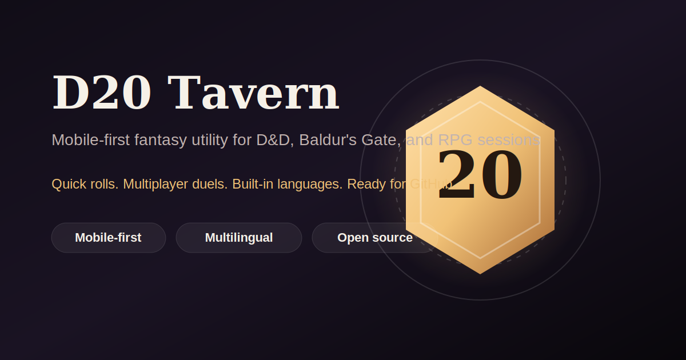

# D20 Tavern



[](LICENSE)
[](https://github.com/WhiteAssassins/dnd-utilities/stargazers)
[](https://github.com/WhiteAssassins/dnd-utilities/network/members)
[](https://github.com/WhiteAssassins/dnd-utilities/issues)

Mobile-first fantasy utility for Dungeons & Dragons, Baldur's Gate, and other tabletop or RPG sessions.

## Highlights

- Built mobile-first for real session use, not just desktop demos
- Fast dice rolling with multiplayer comparison
- Built-in language switching for `es`, `en`, `pt-BR`, `fr`, `de`, and `it`
- Visual direction designed to feel more like a fantasy tool than a generic app
- Framework-free and easy to deploy on GitHub Pages
- Local session persistence and installable PWA support

## Features

### Current

- Solo `d20` rolls
- More dice: `d4`, `d6`, `d8`, `d10`, `d12`, `d20`, `d100`
- Coin flip
- Multiplayer roll comparison
- Tie detection
- Critical and fumble highlights
- Short session history
- Language switching without reload
- LocalStorage persistence for session state
- PWA-ready setup with manifest and service worker

### Planned

- Initiative tracker
- HP and temporary effect trackers
- Random decision tools

## Quick Start

1. Clone the repository.
2. Open `index.html` in your browser.

This project is static and works well with GitHub Pages.

## Project Structure

```text
.
|-- .github/
|-- assets/
|-- index.html
|-- styles.css
|-- translations.js
|-- app.js
|-- manifest.json
|-- sw.js
|-- CONTRIBUTING.md
|-- CODE_OF_CONDUCT.md
|-- LICENSE
|-- TRANSLATING.md
`-- README.md
```

## Internationalization

Supported languages:

- Spanish (`es`)
- English (`en`)
- Portuguese Brazil (`pt-BR`)
- French (`fr`)
- German (`de`)
- Italian (`it`)

Translations live in `translations.js` and cover:

- Static UI text
- Dynamic result messages
- History entries
- Player labels and placeholders
- Document title and meta description

Language selection supports:

- Browser language detection
- `localStorage` persistence
- URL control with `?lang=`

For example:

- `?lang=en`
- `?lang=es`
- `?lang=fr`

## Contributing

Contributions are welcome.

- Read [CONTRIBUTING.md](CONTRIBUTING.md)
- Read [TRANSLATING.md](TRANSLATING.md) for localization updates
- Use the GitHub issue templates for bugs and ideas
- Follow [CODE_OF_CONDUCT.md](CODE_OF_CONDUCT.md)

Good first contributions:

- Add more dice modes
- Improve accessibility and keyboard support
- Add animations for multiplayer results
- Create screenshots or GIFs for the README

## License

Released under the [MIT License](LICENSE).

Copyright (c) 2026 Christopher David Alberto Roque
